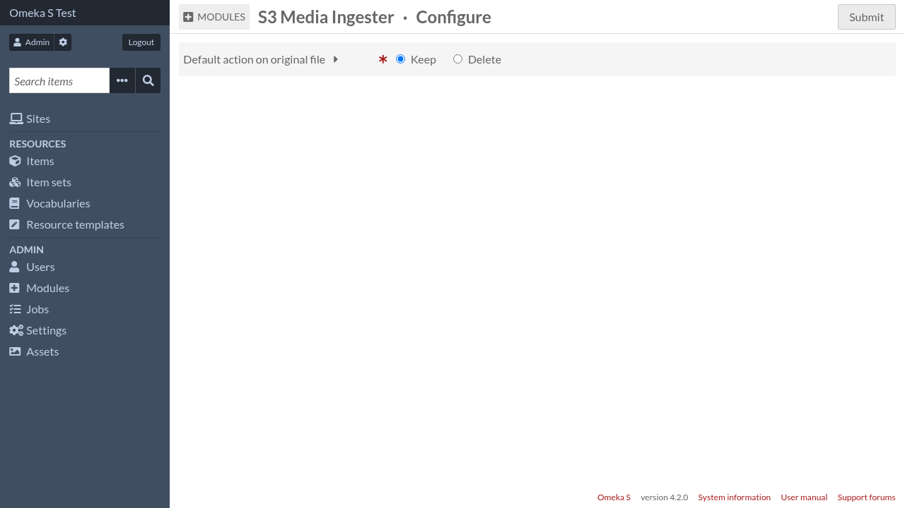

Configuration
=============

S3 sources configuration
------------------------

In Omeka's ``config/local.config.php``, add a section like this::

    return [
        /* ... */
        's3_media_ingester' => [
            'sources' => [
                'my-s3-source' => [
                    'label' => 'My S3 source',
                    'key' => '<key>',
                    'secret' => '<secret>',
                    'region' => '<region>',
                    'endpoint' => '<endpoint>',
                    'bucket' => '<bucket>',
                ],
            ],
        ],
    ];

Module configuration
--------------------

In the module global settings (Admin > Modules > S3MediaIngester's
"Configure" button) you can choose the default action on original files (keep
or delete).

This default action can be overriden when importing new media.
